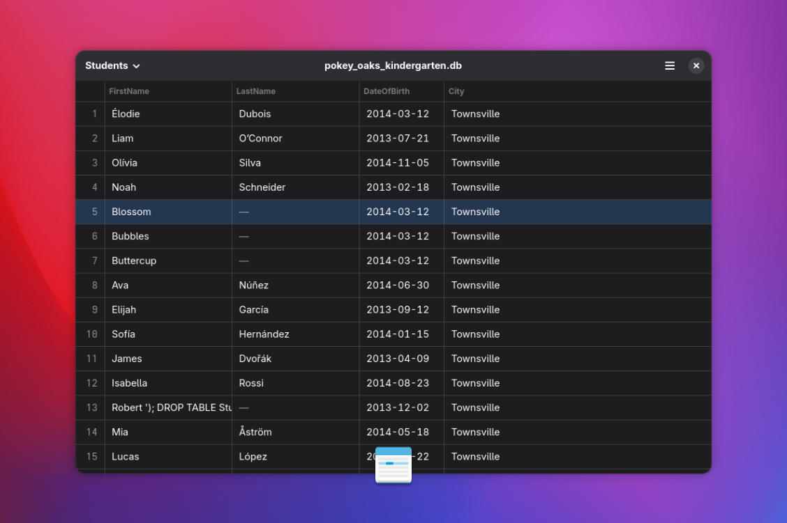

# [Bobby](https://planetpeanut.studio/bobby)

*Browse SQLite files*



Bobby lets you open `SQLite` database files (`.db`, `.sqlite`) and browse the tables inside. Handy for app development or inspecting downloaded databases.


## Install on Linux

Bobby is designed and built for the *GNOME* platform. Available on [Flathub](https://flathub.org/en/apps/studio.planetpeanut.Bobby).

```shell
# Install from Flathub
flatpak remote-add flathub https://flathub.org/repo/flathub.flatpakrepo
flatpak install flathub studio.planetpeanut.Bobby
```


## Build from source

```shell
# Build with Meson
meson setup build
ninja -C build
sudo ninja install -C build
```


## Links

* [@hbons@mastodon.social](https://mastodon.social/@hbons)
* [planetpeanut.studio](https://planetpeanut.studio)

<br>
Have fun, and don't forget to sanitize your database inputs! :)
<br>
<br>
– Hylke
