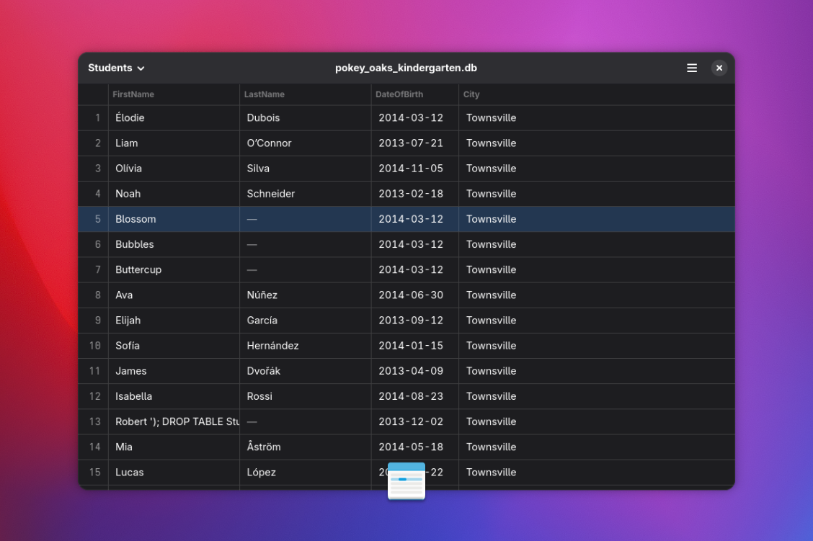

# [Bobby](https://apps.gnome.org/Bobby) 

*Browse SQLite files*



Bobby lets you open `SQLite` database files (`.db`, `.sqlite`) and browse the tables inside. Handy for app development or inspecting downloaded databases.


## Install on Linux

Designed for *GNOME*. Available on [Flathub](https://flathub.org/en/apps/studio.planetpeanut.Bobby).

```shell
flatpak install flathub studio.planetpeanut.Bobby
```


## Build from source

```shell
# Build with Meson
meson setup build
ninja -C build
sudo ninja install -C build
```


## Links

* [@hbons@mastodon.social](https://mastodon.social/@hbons)
* [planetpeanut.studio](https://planetpeanut.studio)

<br>
Have fun, and don't forget to sanitize your database inputs! :)
<br>
<br>
<br>

> [!IMPORTANT]
> Hello! Hylke here. I was recently <a href="https://www.theguardian.com/technology/2025/may/13/microsoft-layoffs" target="_blank">laid off</a>. I'd love to work full-time creating **apps for Linux** and contributing **design for FOSS projects**. I hope to gather enough [monthly sponsors](https://github.com/sponsors/hbons) for a minimum wage. Every little helps. Thank you.
